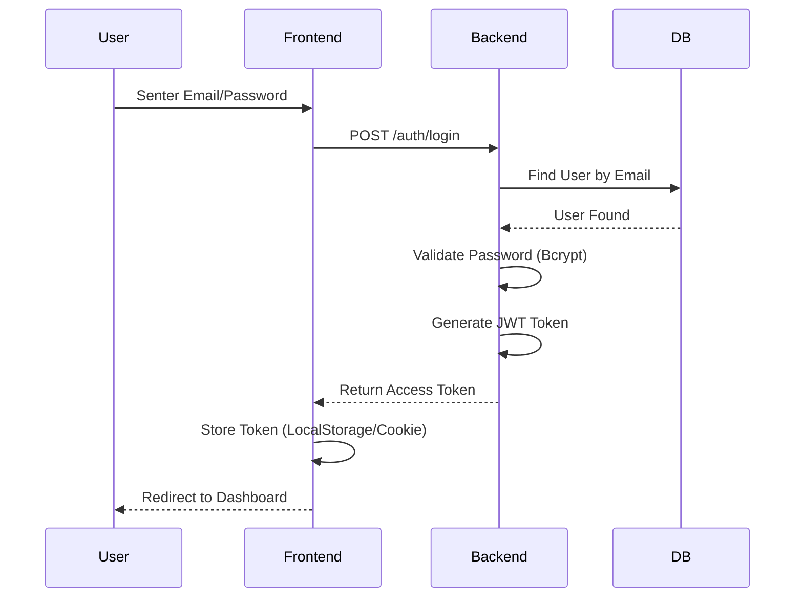
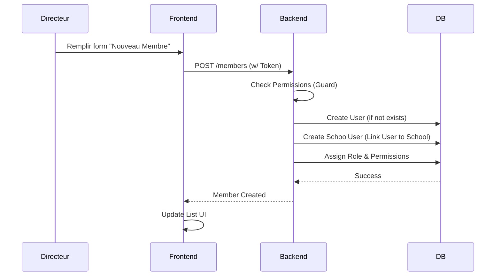
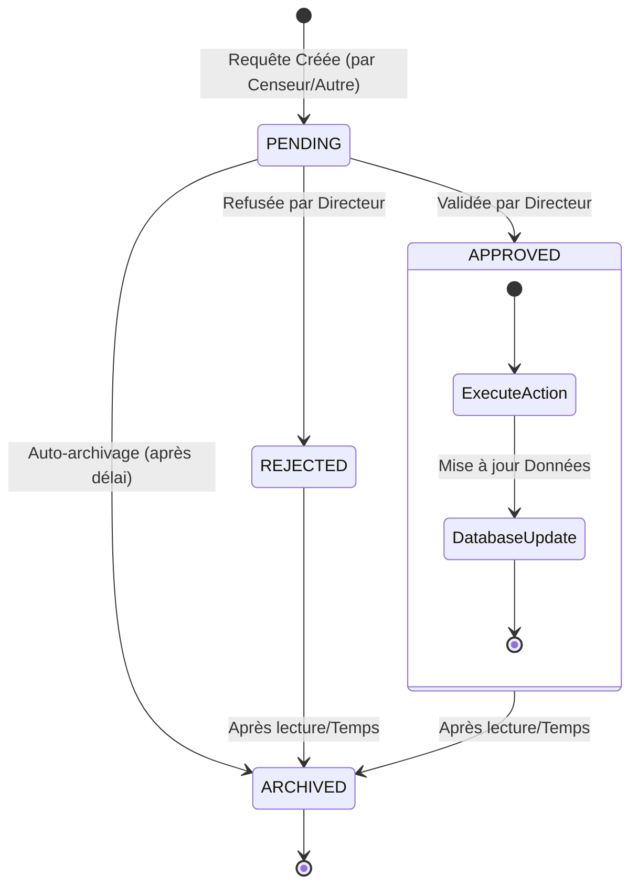

# Architecture du Projet SmartSchool

Ce document décrit l'architecture technique du projet SmartSchool, une plateforme SaaS de gestion scolaire. Il est destiné à aider les développeurs et les parties prenantes à comprendre la structure, les composants et les interactions du système.

## 1. Vue d'ensemble (High-Level Overview)

Le projet est divisé en deux parties principales :
- **Frontend** : Une Single Page Application (SPA) construite avec React et Vite.
- **Backend** : Une API RESTful construite avec NestJS suivant les principes de la Clean Architecture.

### Diagramme de Contexte Système

```mermaid
graph TD
    User((Utilisateur))
    subgraph "SmartSchool System"
        Frontend[Frontend (React/Vite)]
        Backend[Backend API (NestJS)]
        DB[(Database (SQLite/Prisma))]
    end

    User -->|HTTPS| Frontend
    Frontend -->|REST API / JSON| Backend
    Backend -->|Prisma Client| DB
```

---

## 2. Architecture Backend (Clean Architecture)

Le backend utilise **NestJS** et structure le code selon une variation de la **Clean Architecture** (ou Architecture Hexagonale) pour séparer les préoccupations, faciliter les tests et l'évolutivité.

### Structure des Dossiers (`backend/src`)

- **`application/`** : Contient la logique applicative (Use Cases), les Services et les Modules. C'est le point d'entrée des fonctionnalités (ex: `AuthService`, `SchoolService`).
- **`domain/`** : Contient les règles métier pures, les entités et les interfaces. Cette couche ne dépend d'aucun framework externe (théoriquement).
- **`infrastructure/`** : Contient les implémentations concrètes des interfaces du domaine (ex: Repositories Prisma, Adaptateurs de services externes, Stratégies d'authentification).
- **`interface/`** : (Optionnel/Présent) Peut contenir les DTOs ou interfaces partagées entre les couches.

### Diagramme des Couches Backend

```mermaid
graph TD
    subgraph "API Layer (Controllers)"
        Controllers[Contrôleurs NestJS]
    end

    subgraph "Application Layer"
        Services[Services Applicatifs (ex: createSchool)]
        UseCases[Cas d'Utilisation]
    end

    subgraph "Domain Layer"
        Entities[Entités Métier]
        Interfaces[Interfaces de Repository]
    end

    subgraph "Infrastructure Layer"
        PrismaRepo[Implémentation Prisma Repository]
        AuthStrat[Stratégies Auth (JWT)]
    end

    Controllers --> Services
    Services --> Interfaces
    Services --> Entities
    PrismaRepo -.->|Implements| Interfaces
    PrismaRepo -->|Uses| DB[(Base de données)]
```

### Modules Principaux

| Module | Description |
| :--- | :--- |
| **Auth** | Gestion de l'authentification (Login, Register), JWT, Password Reset. |
| **School** | Gestion des établissements scolaires (Création, Configuration, Cycles). |
| **Members** | Gestion du personnel administratif (Directeurs, Surveillants, etc.) et de leurs rôles. |
| **Teachers** | Gestion des enseignants (Profils, Matières, Affectations). |
| **Students** | Gestion des élèves (Inscriptions, Liste, Parents). |
| **Vie Scolaire** | Gestion de la discipline (Sanctions, Récompenses, Absences/Assiduité). |
| **Classes/Subjects** | Gestion pédagogique (Classes, Matières, Notes). |
| **Notifications** | Système de notifications internes pour les utilisateurs. |

---

## 3. Base de Données (Data Model)

La base de données est gérée par **Prisma ORM**. Le schéma est relationnel et centré autour des entités `User` (Compte global) et `School` (Tenant).

### Modèle Entité-Relation (Simplifié)

```mermaid
erDiagram
    User ||--o{ SchoolUser : "has roles in"
    School ||--o{ SchoolUser : "employs"
    School ||--o{ Student : "enrolls"
    School ||--o{ Class : "has"
    School ||--o{ Teacher : "employs"
    
    Class ||--o{ Student : "contains"
    Teacher }|--|{ Subject : "teaches"
    Class }|--|{ Subject : "learns (ClassSubject)"
    
    Student ||--o{ Grade : "receives"
    Student ||--o{ Attendance : "has"
    Student ||--o{ Sanction : "receives"

    User {
        string id PK
        string email
        string password
        string role
    }

    School {
        string id PK
        string name
        string plan
    }

    SchoolUser {
        string userId FK
        string schoolId FK
        string role
        string permissions
    }

    Student {
        string id PK
        string matricule
        string name
    }
```

### Points Clés du Schéma
*   **`User` vs `SchoolUser`** : Un utilisateur (`User`) peut appartenir à plusieurs écoles avec des rôles différents via la table de liaison `SchoolUser`. C'est une architecture multi-tenant logique.
*   **RBAC (Role-Based Access Control)** : Les permissions sont gérées via `RolePermission`, permettant une granularité fine des droits par école.
*   **Vie Scolaire** : Les tables `Sanction`, `Reward`, `Incident` sont liées à `Student` et `School`.

---

## 4. Architecture Frontend

Le frontend est une application **React** moderne utilisant **Vite** pour le build.

### Structure des Dossiers (`frontend/src`)

- **`app/`** : Configuration globale de l'application (Routes, Providers).
- **`pages/`** : Composants de haut niveau correspondant aux routes (ex: `LoginPage`, `DashboardPage`).
- **`components/`** : Composants UI réutilisables (Boutons, Inputs, Cards).
- **`layouts/`** : Structures de mise en page (ex: `DashboardLayout` avec Sidebar et Header).
- **`shared/`** : Code partagé (API clients, Utils, Types, Hooks globaux).
- **`services/`** : (Legacy ou Spécifique) Services métier frontend.

### Flux de Données (Data Flow)

1.  **Component** (Page) demande des données.
2.  Appel via un **Hook** personnalisé (ex: `useAuth`, `useSchool`) ou directement via l'API client.
3.  **Axios** (dans `shared/api`) effectue la requête HTTP vers le Backend.
4.  Le Backend répond, et le state React est mis à jour.
5.  **Context API** est utilisé pour l'état global (AuthUser, Theme, Language).

---

## 5. Flux Critiques (Sequence Diagrams)

### Authentification (Login)



### Création d'un Membre du Personnel



---

## 6. Diagrammes Complémentaires

### Architecture des Composants Frontend (Vue par Rôle)

Le Frontend sert différents tableaux de bord selon le rôle de l'utilisateur connecté.

```mermaid
graph TD
    App[App Entry (main.tsx)] --> Router
    Router --> AuthPages[Pages Publiques]
    Router --> Protected[Layout Protégé (DashboardLayout)]
    
    AuthPages --> Login[LoginPage]
    AuthPages --> Register[RegisterPage]
    
    Protected --> CheckRole{Vérification Rôle}
    
    CheckRole -->|FOUNDER| FounderDash[FounderDashboard]
    CheckRole -->|DIRECTOR| DirectorDash[DirectorDashboard]
    CheckRole -->|CENSOR| CensorDash[CensorDashboard]
    CheckRole -->|TEACHER| TeacherDash[TeacherDashboard]
    CheckRole -->|STUDENT| StudentDash[StudentDashboard]
    CheckRole -->|PARENT| ParentDash[ParentDashboard]

    
    FounderDash --> SchoolMgmt[Gestion Écoles]
    DirectorDash --> TeacherMgmt[Gestion Enseignants]
    DirectorDash --> FinMgmt[Gestion Financière]
    CensorDash --> Classes[Gestion Classes]
    CensorDash --> Grades[Gestion Notes]
```

### Diagramme d'États : Cycle de Vie d'une Requête Administrative

Certaines actions (modification enseignants, suppression) nécessitent une validation.



### Architecture de Déploiement (Infrastructure)

```mermaid
graph TD
    Client[Navigateur Client (PC/Mobile)]
    
    subgraph "Cloud / Serveur"
        LB[Load Balancer / Reverse Proxy]
        
        subgraph "Backend Container"
            API[NestJS API Server]
        end
        
        subgraph "Frontend Container"
            Web[Serveur Fichiers Statiques (Vite/Nginx)]
        end
        
        DB[(PostgreSQL/SQLite Volume)]
    end
    
    Client -->|HTTPS / 443| LB
    LB -->|/api/*| API
    LB -->|/*| Web
    API -->|TCP / 5432| DB
```

> **Note**: Les diagrammes ci-dessus sont générés automatiquement avec **Mermaid.js**. Si vous ne les voyez pas, assurez-vous d'utiliser un lecteur Markdown compatible (comme GitHub, VS Code avec extension, ou un éditeur en ligne).

