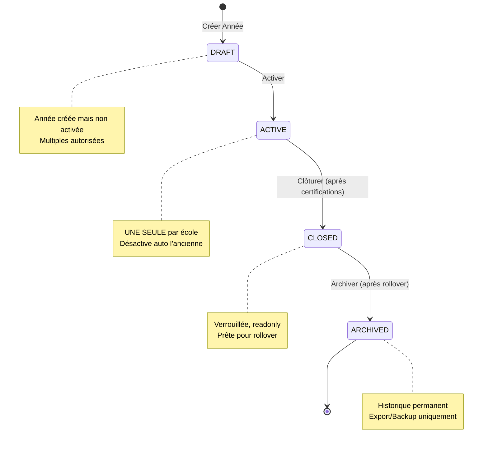
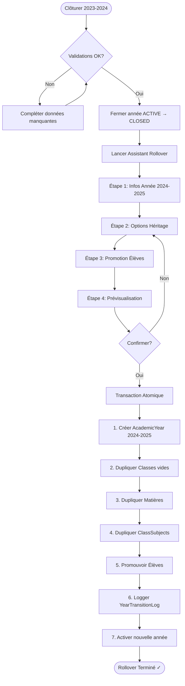

# Gestion Complète du Cycle de Vie des Années Scolaires

## Contexte

L'application SmartSchool possède déjà :
- Un modèle `AcademicYear` de base avec des champs de certification
- Un `AcademicYearsService` minimal (création, listing, activation)
- Un `TransitionsService` qui gère la clôture d'année et les promotions d'élèves

**Objectif** : Améliorer et compléter ce système pour offrir une gestion complète du cycle de vie des années scolaires incluant :
1. **Activation** : Démarrer une nouvelle année scolaire
2. **Suivi** : Monitorer l'état et les validations nécessaires
3. **Clôture** : Fermer l'année avec validations (finances + pédagogique)
4. **Transition** : Créer l'année suivante en héritant intelligemment des données de l'année précédente

## Stratégie Recommandée (Basée sur les Meilleures Pratiques)

Après recherche approfondie des systèmes leaders (PowerSchool, Skyward, Infinite Campus), voici la stratégie optimale :

### 🎯 Workflow en 3 Phases (Industrie Standard)

> [!NOTE]
> **Première Année** : 
> - Lors de la création d'une école, aucune année scolaire n'est créée automatiquement
> - Le **Fondateur** ou le **Directeur** doit créer manuellement la première année via **Configuration → Années Scolaires**
> - Cette première année créée sera automatiquement en statut `ACTIVE` (pas besoin de cliquer "Activer")
> - Les phases ci-dessous s'appliquent aux transitions d'années suivantes

**Phase 1 : Préparation de Clôture** (Avant fin d'année)
- Validation complète des données de l'année courante
- Certification Finance + Pédagogique (audit complet)
- Saisie des décisions du conseil de classe pour TOUS les élèves

**Phase 2 : Clôture & Archivage** (Dernier jour d'école)
- Verrouillage de l'année (`status = CLOSED`)
- Génération des rapports finaux (bulletins, statistiques)
- Archivage permanent des données sensibles

**Phase 3 : Rollover Guidé** (Vacances d'été)
- Assistant multi-étapes pour créer l'année suivante
- Héritage intelligent et configurable des données
- Promotion automatique des élèves selon décisions

### 📋 Stratégie d'Héritage des Données

> [!NOTE]
> **Principe PowerSchool** : "Clone Structure, Not Data"

**✅ À Hériter AUTOMATIQUEMENT** :
1. **Structure des Classes** : Noms, niveaux, cycles (SANS les élèves)
2. **Matières & Coefficients** : Toutes les matières avec leurs coefficients
3. **Affectations Matières-Classes** : Les liens `ClassSubject` (profs réaffectés manuellement)
4. **Frais de Scolarité** : `tuitionFee` et `registrationFee` par classe
5. **Calendrier Scolaire** : Structure des trimestres/semestres (dates ajustées)

**❌ NE PAS Hériter** :
- Notes et moyennes (archivées dans `StudentAcademicHistory`)
- Paiements (données financières restent dans l'année source)
- Absences et sanctions (conservées historiquement)
- Emplois du temps (à recréer, car profs/salles peuvent changer)

### 👨‍🎓 Stratégie de Gestion des Élèves

**Approche Recommandée** : **"Smart Promotion with Validation"** (Skyward Style)

```
┌─────────────────────────────────────────────────────┐
│  Étape 1 : Analyse Automatique                     │
├─────────────────────────────────────────────────────┤
│  Le système analyse StudentAcademicHistory :        │
│  - Outcome = "PASS" → Élève éligible promotion     │
│  - Outcome = "FAIL" → Élève redouble               │
│  - Outcome = "GRADUATED" → Élève archivé           │
│  - Outcome = "TRANSFERRED" → Statut spécial        │
└─────────────────────────────────────────────────────┘
          │
          ▼
┌─────────────────────────────────────────────────────┐
│  Étape 2 : Prévisualisation Intelligente           │
├─────────────────────────────────────────────────────┤
│  Tableau de bord montrant :                         │
│  - 6ème A (28 élèves) → 5ème A (22), 5ème B (6)    │
│  - 6ème B (30 élèves) → 5ème B (24), 6ème B (4 red)│
│  - CM2 (25 élèves) → 6ème A (25) [transition cycle]│
│                                                      │
│  ⚠️ Alertes : 3 élèves sans décision conseil       │
└─────────────────────────────────────────────────────┘
          │
          ▼
┌─────────────────────────────────────────────────────┐
│  Étape 3 : Ajustements Manuels (Optionnel)         │
├─────────────────────────────────────────────────────┤
│  Interface pour rectifier :                         │
│  - Classe cible (cas particuliers)                  │
│  - Désactiver certaines promotions                  │
│  - Gérer les nouvelles inscriptions                 │
└─────────────────────────────────────────────────────┘
          │
          ▼
┌─────────────────────────────────────────────────────┐
│  Étape 4 : Exécution en Transaction                │
├─────────────────────────────────────────────────────┤
│  Mise à jour atomique :                             │
│  - Student.classId (nouvelle classe)                │
│  - Student.status (ACTIVE/ARCHIVED/PENDING)         │
│  - Logging dans YearTransitionLog                   │
└─────────────────────────────────────────────────────┘
```

**Cas Particuliers Gérés** :
- **Redoublants** : Restent dans la même classe (dupliquée dans nouvelle année)
- **Diplômés** : `status = ARCHIVED`, `classId = null`
- **Transférés** : `status = TRANSFERRED`, conservés pour historique
- **Nouveaux** : `status = PENDING`, affectés manuellement par secrétariat

### 🏷️ Système de Statuts (Best Practice)

**Recommandation** : **Enum Status + Sous-booléens**

```prisma
model AcademicYear {
  // ...
  status            YearStatus @default(DRAFT)
  isActive          Boolean    @default(false)  // Calcul: status == ACTIVE
  isArchived        Boolean    @default(false)  // Calcul: status == ARCHIVED
  
  financeCertified  Boolean    @default(false)
  academicCertified Boolean    @default(false)
  closedAt          DateTime?
  archivedAt        DateTime?
}

enum YearStatus {
  DRAFT      // Année créée, pas encore activée
  ACTIVE     // Année en cours
  CLOSED     // Clôturée, mais pas encore archivée
  ARCHIVED   // Archivée définitivement
}
```

**Transitions de Statut** :
```
DRAFT → ACTIVE      : Action "Activer"
ACTIVE → CLOSED     : Action "Clôturer" (après certifications)
CLOSED → ARCHIVED   : Action "Archiver" (après rollover)
```

### 🔒 Règles de Validation (Checklist Automatique)

Avant de permettre la clôture, le système vérifie :

```typescript
interface ClosureValidation {
  financeCertified: boolean;       // ✓ Comptable a validé
  academicCertified: boolean;      // ✓ Direction pédagogique a validé
  allStudentsDecided: boolean;     // ✓ 100% élèves avec décision conseil
  noOutstandingGrades: boolean;    // ✓ Toutes notes saisies
  yearEndReportsGenerated: boolean; // ✓ Bulletins finaux générés
  
  canClose: boolean;  // true si TOUT est ✓
  blockers: string[]; // Liste des problèmes bloquants
}
```

### 🔄 Contraintes Multi-Années

**Règle Métier** (Standard Industrie) :
- **1 seule année ACTIVE** par école à la fois
- **Multiples années DRAFT** autorisées (pré-création)
- **Multiples années CLOSED/ARCHIVED** pour historique

> [!WARNING]
> **Règle de Création Stricte** :
> - Impossible de créer une nouvelle année si une année ACTIVE existe
> - L'utilisateur DOIT d'abord clôturer l'année active
> - Le backend rejette la création avec message explicite
> - Le frontend affiche un avertissement avec lien vers clôture

**Contrôle lors de la création** :
```typescript
// Avant de créer une nouvelle année
async create(schoolId: string, dto: CreateAcademicYearDto) {
  // 1. Vérifier qu'aucune année ACTIVE n'existe (sauf si c'est la toute première)
  const activeYear = await prisma.academicYear.findFirst({
    where: { schoolId, status: 'ACTIVE' }
  });
  
  if (activeYear) {
    throw new BadRequestException(
      `Impossible de créer une nouvelle année. ` +
      `L'année "${activeYear.name}" est actuellement active. ` +
      `Veuillez d'abord la clôturer dans Programme Scolaire > Clôturer l'Année.`
    );
  }
  
  // 2. Créer l'année en statut DRAFT (ou ACTIVE si première année)
  const existingYears = await prisma.academicYear.count({
    where: { schoolId }
  });
  
  const isFirstYear = existingYears === 0;
  
  return prisma.academicYear.create({
    data: {
      schoolId,
      name: dto.name,
      startDate: new Date(dto.startDate),
      endDate: new Date(dto.endDate),
      status: isFirstYear ? 'ACTIVE' : 'DRAFT',  // Première année = auto-activée
      isActive: isFirstYear
    }
  });
}
```

> [!NOTE]
> **Cas Spécial - Première Année** :
> - Lorsque l'école n'a encore aucune année scolaire (count = 0)
> - Le Fondateur ou Directeur crée manuellement la première année via Configuration
> - Elle est automatiquement créée en statut `ACTIVE` (évite l'étape "Activer")
> - Les années suivantes sont créées en `DRAFT` et nécessitent activation manuelle


**Contrôle lors de l'activation** :
```typescript
// Lors de l'activation d'une année
async activate(yearId: string) {
  // 1. Désactiver automatiquement l'année active actuelle
  await prisma.academicYear.updateMany({
    where: { schoolId, status: 'ACTIVE' },
    data: { status: 'CLOSED' }  // Auto-fermeture
  });
  
  // 2. Activer la nouvelle année
  await prisma.academicYear.update({
    where: { id: yearId },
    data: { status: 'ACTIVE', isActive: true }
  });
}
```

### 📊 Visualisation du Cycle de Vie



### 🔄 Workflow Assistant de Rollover



## Plan d'Implémentation Détaillé

### Backend - Database Schema

#### [MODIFY] schema.prisma

**Enrichir le modèle `AcademicYear`** (lignes 125-143) :
- Ajouter `status` enum : DRAFT, ACTIVE, CLOSED, ARCHIVED
- Ajouter `closedAt DateTime?` - Date de clôture
- Ajouter `createdFromId String?` - Référence à l'année source (héritage)
- Ajouter relation `createdFrom AcademicYear?` - Pour tracer l'origine

**Créer un nouveau modèle `YearTransitionLog`** :
```prisma
model YearTransitionLog {
  id            String   @id @default(uuid())
  fromYearId    String
  toYearId      String
  fromYear      AcademicYear @relation("FromYear", ...)
  toYear        AcademicYear @relation("ToYear", ...)
  
  entityType    String   // CLASS, SUBJECT, TEACHER, STUDENT, FEE
  action        String   // INHERITED, PROMOTED, SKIPPED
  sourceId      String?
  targetId      String?
  metadata      String?  // JSON with additional context
  
  createdAt     DateTime @default(now())
}
```

---

### Backend - Services

#### [MODIFY] academic-years.service.ts

**Méthodes à ajouter/améliorer** :

1. **`create(schoolId: string, dto: CreateAcademicYearDto)`**
   - ⚠️ **Vérifier qu'aucune année ACTIVE n'existe** (règle critique)
   - Si année active trouvée : Lever BadRequestException avec message explicite
   - Créer l'année en statut DRAFT
   - Retourner l'année créée

2. **`getYearWithStatus(schoolId: string, yearId: string)`**
   - Retourne l'année avec statistiques détaillées
   - Nombre de classes, élèves, enseignants
   - Statut des certifications
   - Blocages potentiels pour la clôture

3. **`validateClosure(schoolId: string, yearId: string)`**
   - Vérifie toutes les conditions de clôture
   - Retourne une liste de vérifications (✓/✗)

4. **`closeYear(schoolId: string, yearId: string)`**
   - Valider les certifications avant clôture
   - Mettre à jour `status = 'CLOSED'`, `closedAt = now()`
   - Désactiver l'année

5. **`archiveYear(schoolId: string, yearId: string)`**
   - Archiver définitivement une année fermée
   - Mettre à jour `status = 'ARCHIVED'`, `archivedAt = now()`

#### [NEW] year-transition.service.ts

Nouveau service dédié à la transition entre années avec méthodes pour :
- `previewTransition()` - Aperçu de ce qui sera hérité
- `createNextYear()` - Créer l'année suivante avec héritage intelligent

---

### Frontend - Components & Pages

> [!IMPORTANT]
> **Architecture de Navigation** :
> - **Configuration** (Fondateur/Directeur) : Gestion des années (création, activation, rollover)
> - **Programme Scolaire → Clôturer l'Année** (Directeur) : Clôture de l'année active

#### Section 1 : Configuration - Gestion des Années Scolaires

##### ConfigurationAcademicYearsSection.tsx

Section dans la page Configuration avec :
- Liste des années (cards) triées par date
- Actions selon statut (Activer, Créer Suivante, Archiver)
- Permissions différenciées (Fondateur/Directeur)

##### CreateYearModal.tsx

Modal de création avec validation d'année active et UI bloquante si nécessaire.

##### YearTransitionWizard.tsx

Assistant 4 étapes pour rollover :
1. Informations de base
2. Options d'héritage
3. Prévisualisation
4. Confirmation et exécution

#### Section 2 : Programme Scolaire - Clôture

##### AcademicProgramClosureTab.tsx

Onglet dans "Programme Scolaire" avec :
- Checklist de validation dynamique
- Bouton clôture (activé si validations OK)
- Liens vers détails des blockers

##### YearClosureConfirmationModal.tsx

Modal de confirmation finale avec avertissement irréversibilité.

---

### Tests Manuel - Scénario Complet

1. **Créer première année** (onboarding) → Auto-activée
2. **Ajouter données** (classes, matières, élèves)
3. **Certifier et clôturer** (après validations complètes)
4. **Créer année suivante** (via wizard rollover)
5. **Vérifier héritage** (données correctement migrées)

**Indicateurs de succès** :
- ✅ Workflow complet sans erreurs
- ✅ Données correctement héritées
- ✅ Élèves promus dans les bonnes classes
- ✅ Pas de perte de données
- ✅ Logs de transition créés
