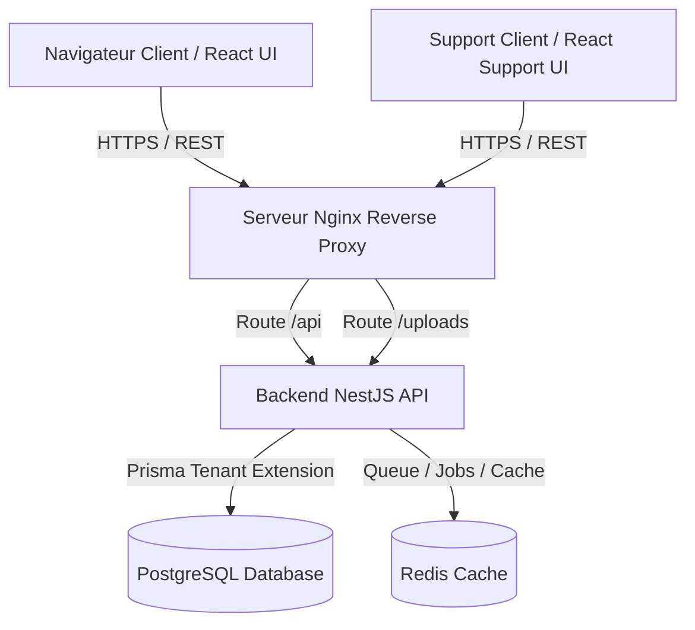
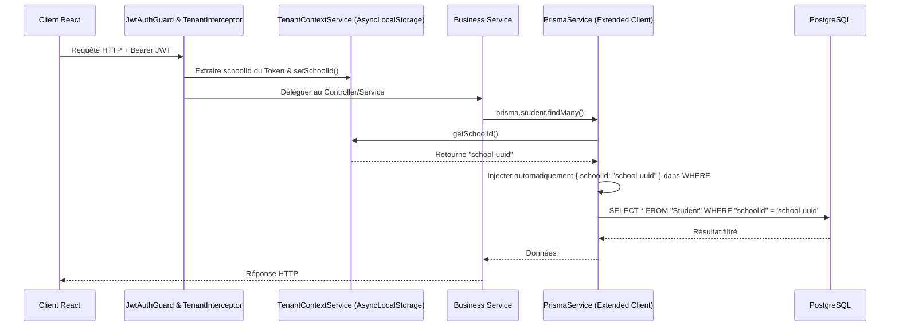

# 🏗️ Rapport d'Analyse Intégrale - SmartSchool v2.0

Ce rapport présente une analyse approfondie et complète du codebase de la solution **SmartSchool v2.0**, un système de gestion scolaire d'entreprise de niveau production reposant sur une architecture moderne multi-tenant.

---

## 📊 1. Résumé Exécutif

SmartSchool v2.0 est conçu sur une stack technologique robuste et moderne :
- **Backend** : NestJS (v11), Prisma ORM (v6), PostgreSQL, Redis (Cache & Queues), et Puppeteer (génération de PDFs).
- **Frontend Principal** : React (Vite, TypeScript, TailwindCSS) avec des tableaux de bord spécifiques pour **9 rôles distincts**.
- **Portail de Support** : Interface autonome (`frontend-support`) dédiée aux techniciens de maintenance, intégrant un contrôle d'accès temporaire et le masquage des données sensibles.
- **Conteneurisation** : Docker, Nginx (images Unprivileged) et Docker Compose pour une isolation totale et une sécurité accrue en production.

L'état global de l'application est **excellent**. Le code est propre, structuré selon des règles architecturales claires (Clean Architecture / DDD), et intègre des dispositifs de sécurité avancés (isolation de requêtes par tenant via `AsyncLocalStorage`, masquage automatique des données privées pour le support, et clés d'idempotence pour les transactions financières).

---

## 🏗️ 2. Architecture Globale et Structure du Projet

L'application est organisée sous la forme d'un mono-dossier contenant les modules principaux suivants :

```
shining-universe/
├── .env                      # Variables d'environnement globales
├── docker-compose.yml        # Orchestration multi-conteneurs
├── backend/                  # API NestJS (Clean Architecture)
│   ├── src/                  # Code source backend
│   ├── prisma/               # Schéma et scripts de migration de données
│   └── Dockerfile            # Build multi-stage pour le backend
├── frontend/                 # Application web React principale (Vite)
│   ├── src/                  # Code source frontend
│   └── Dockerfile            # Nginx Unprivileged pour le frontend
├── frontend-support/        # Portail d'administration & support technique
│   ├── src/                  # Code source portail de support
│   └── Dockerfile            # Nginx Unprivileged pour le portail support
└── docs/                     # Documentation et guides d'architecture
```

### Flux Système et Interactions des Composants



---

## 🗄️ 3. Modèle de Données & Schéma de Base de Données

Le schéma de données (`schema.prisma`) comprend plus de 1200 lignes et modélise de manière exhaustive le fonctionnement d'un établissement d'enseignement.

### A. Entités Clés du Système

1. **Utilisateurs et Rôles (`User`, `SchoolUser`, `PermissionDefinition`, `RolePermission`)** :
   - Gestion fine des accès. Un `User` peut appartenir à plusieurs écoles (`SchoolUser`) avec des rôles spécifiques.
   - Les permissions (`PermissionDefinition`) sont dynamiques et attribuées par rôle (ex: `students.manage`, `finance.view`), avec prise en compte des types de directeurs par cycle scolaire (`directorType`).

2. **Établissements (`School`, `SchoolConfig`, `Subscription`)** :
   - Support complet du multi-tenant. Chaque école possède sa configuration de branding (logo, couleurs, devise) et son plan de facturation SaaS (`SubscriptionPlan` : FREE, STARTER, PROFESSIONAL, ENTERPRISE, CUSTOM).

3. **Années Académiques et Transitions (`AcademicYear`, `YearTransitionLog`)** :
   - Gestion des transitions d'années scolaires (Rollover). Une année passe par plusieurs états : `DRAFT`, `ACTIVE`, `CLOSED`, `ARCHIVED`.
   - Clôture sécurisée soumise à 3 certifications obligatoires : financière (`financeCertified`), et académiques par cycle (`maternellePrimaireCertified`, `collegeLyceeCertified`).

4. **Gestion Scolaire Principale (`Student`, `Class`, `Subject`, `Grade`, `Attendance`)** :
   - Suivi académique, relevé de notes avec coefficients, pointage des présences (`ABSENCE` ou `RETARD`) et historique d'orientation des élèves (`StudentAcademicHistory`).

5. **Vie Scolaire (`Sanction`, `Reward`, `Incident`, `Announcement`)** :
   - Gestion de la discipline (avertissements, exclusions, tableaux d'honneur) et système d'annonces ciblées selon l'audience (`ALL`, `TEACHERS`, `PARENTS`, `STUDENTS`).

6. **Module de Finance Avancée (`Payment`, `Expense`, `Payroll`, `FinancialTransaction`, `FeeCategory`, `ClassFee`, `FeeInstallment`)** :
   - Structuration des frais de scolarité par niveau et série (`ClassFee`), divisés en échéances programmées (`FeeInstallment`).
   - Traitement des transactions financières avec clés d'idempotence uniques pour éviter les doubles débits. Prise en charge des moyens de paiement modernes (Stripe, Orange Money, MTN MoMo, Wave, Celtiis, Espèces).

7. **Système de Support Technique (`Ticket`, `TicketMessage`, `SupportTemporaryAccess`, `SupportAuditLog`)** :
   - Permet aux techniciens d'obtenir un accès temporaire en lecture seule (`SupportTemporaryAccess`) à la base de données d'une école pour résoudre un incident, avec traçabilité complète des actions (`SupportAuditLog`).

---

## 🔒 4. Sécurité Globale & Isolation Multi-Tenant

La sécurité de SmartSchool repose sur plusieurs mécanismes haut de gamme intégrés à tous les niveaux.

### A. Isolation Native Multi-Tenant (Niveau Prisma)

Pour éviter toute fuite de données entre les écoles (SaaS), le backend implémente une isolation stricte au niveau de la couche ORM (Prisma) à l'aide d'un intercepteur global et d'une extension de client :

1. Le `TenantInterceptor` intercepte la requête HTTP, extrait le `schoolId` du token JWT validé, et l'injecte dans le `TenantContextService`.
2. Le `TenantContextService` s'appuie sur le mécanisme **`AsyncLocalStorage`** de Node.js pour conserver cet ID de manière isolée pour toute la durée de vie de la requête asynchrone.
3. Le `PrismaService` utilise une extension native `$extends` couplée à un **Proxy JavaScript**. Lors de chaque requête à la base de données, Prisma vérifie si le modèle ciblé contient un champ `schoolId`. Si c'est le cas, le filtre `{ schoolId }` est injecté automatiquement de manière transparente dans la clause `where` ou dans la charge utile de création (`data`).

#### Diagramme de Séquence de l'Isolation Multi-Tenant



### B. Transparence du Soft-Delete (Suppression Logique)

Le schéma utilise des champs `deletedAt` pour archiver les données sans les supprimer physiquement. L'extension Prisma intercepte automatiquement toutes les requêtes de lecture (`findMany`, `findFirst`, etc.) sur les modèles supportant le soft-delete et y applique par défaut le filtre `{ deletedAt: null }`.

### C. Masquage des Données Sensibles (`PrivacyInterceptor`)

Lorsqu'un technicien support de la plateforme (`SUPPORT_TECH`) accède aux données d'une école pour débogage, le `PrivacyInterceptor` de NestJS intercepte la réponse HTTP et applique un masque sur les données privées :
- Les numéros de téléphone sont convertis (ex: `+229 97•• •• 12`).
- Les emails sont tronqués (ex: `j••••@domaine.com`).
Cela garantit la conformité avec la réglementation sur la protection des données personnelles (ex: RGPD).

### D. Prévention des Doubles Débits (`IdempotencyGuard`)

Les requêtes financières requièrent l'en-tête `x-idempotency-key`. Le `IdempotencyGuard` intercepte les requêtes de transaction et vérifie si la clé a déjà été traitée dans la table `FinancialTransaction` afin de rejeter toute soumission en doublon.

---

## 🐳 5. Conteneurisation, DevOps & Déploiement

Le déploiement est orchestré de manière sécurisée et optimisée :

1. **Docker Compose** : Déclare 5 services interconnectés sur un réseau privé bridge (`smartschool-network`).
2. **Système de Fichiers en Lecture Seule** : Les conteneurs API, UI et Support s'exécutent avec le drapeau `read_only: true`. Seuls les dossiers nécessaires (ex: `/tmp`, `/app/uploads`) sont configurés en écriture temporaire (`tmpfs` ou volumes persistants), réduisant la surface d'attaque en cas d'intrusion.
3. **Sécurité d'Exécution** : Les conteneurs utilisent l'option `no-new-privileges:true` pour empêcher toute élévation de privilèges.
4. **Nginx Unprivileged** : Les interfaces web (UI principale et Support) utilisent des serveurs Nginx s'exécutant sur le port `8080` avec un utilisateur non-root.
5. **Dumb-Init** : L'image de production NestJS intègre `dumb-init` comme PID 1 pour assurer une gestion correcte des signaux d'arrêt UNIX (`SIGTERM`) et éviter la prolifération de processus Puppeteer zombies.

---

## 📈 6. Recommandations et Axes d'Amélioration

Bien que l'architecture soit de niveau professionnel, plusieurs ajustements stratégiques peuvent optimiser l'infrastructure :

### 🟡 Priorité Haute
1. **Nettoyage des fichiers `.env` redondants** :
   Le fichier `.env.production` à la racine fait doublon avec `.env` et le modèle `.env.example`. Il est recommandé de le supprimer pour éviter toute dérive de configuration.
2. **Code-Splitting de l'Application Frontend** :
   La taille du bundle frontend principal dépasse les 1,7 Mo. L'activation du découpage de code (code-splitting) dans `vite.config.ts` (en séparant les dépendances lourdes comme Chart.js ou FullCalendar) réduira le temps de chargement initial.

### 🟢 Améliorations Futures (Roadmap)
1. **Intégration d'un système de queues résilient** :
   Bien que NestJS intègre `@nestjs/bull`, l'implémentation complète des queues pour les tâches asynchrones lourdes (génération des bulletins PDFs via Puppeteer et envoi d'emails via Nodemailer) permettra de libérer l'API principale de la charge bloquante.
2. **Mise en place de tests E2E critiques** :
   Ajouter des suites de tests Playwright ou Cypress sur les parcours critiques (Authentification -> Inscription Élève -> Enregistrement Paiement).
3. **Logs JSON structurés** :
   Remplacer les appels `console.log` standard du backend par un logger structuré (Pino/Winston) exportant au format JSON, afin de faciliter l'indexation dans une pile ELK ou Grafana Loki.

---

## ✅ 7. Tableau de Score Technique

| Critère | Note | Commentaire |
| :--- | :---: | :--- |
| **Sécurité Multi-Tenant** | 10/10 | Isolation Prisma native par `AsyncLocalStorage` remarquable. |
| **Architecture Logicielle** | 9/10 | Découpage propre (Clean Arch) et modularité exceptionnelle. |
| **DevOps / Container Security** | 9/10 | Conteneurs non-root, read-only FS, dumb-init configurés. |
| **Sécurité Financière** | 9/10 | Garde d'idempotence et traçabilité des états transactionnels. |
| **Performance Frontend** | 7/10 | Bundle principal lourd, code-splitting requis. |
| **Documentation & Config** | 8/10 | `.env.example` très détaillé, Swagger présent en mode dév. |

**Score Global : 8.7/10 - Niveau Production Enterprise** 🚀
