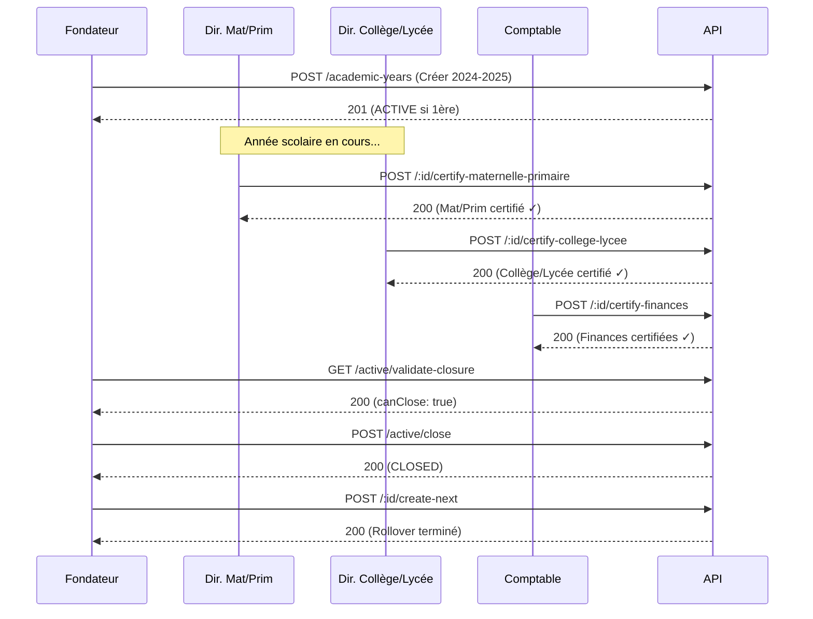

# API Documentation - Gestion des Années Scolaires

## Vue d'ensemble

API complète pour la gestion du cycle de vie des années scolaires avec système de certifications multi-directeurs.

**Base URL** : `/academic-years`

**Authentification** : JWT (cookie `access_token` ou header `Authorization: Bearer <token>`)

---

## Endpoints

### 1. Créer une Année Scolaire

```http
POST /academic-years
```

**Permissions** : `FOUNDER` uniquement

**Body** :
```json
{
  "name": "2024-2025",
  "startDate": "2024-09-01T00:00:00.000Z",
  "endDate": "2025-06-30T23:59:59.999Z"
}
```

**Réponse 201** :
```json
{
  "id": "uuid",
  "name": "2024-2025",
  "startDate": "2024-09-01T00:00:00.000Z",
  "endDate": "2025-06-30T23:59:59.999Z",
  "status": "ACTIVE",  // "ACTIVE" si première année, sinon "DRAFT"
  "financeCertified": false,
  "maternellePrimaireCertified": false,
  "collegeLyceeCertified": false,
  "createdAt": "2024-12-19T00:00:00.000Z"
}
```

**Erreur 400** (année active existe) :
```json
{
  "statusCode": 400,
  "message": "Impossible de créer une nouvelle année. L'année \"2023-2024\" est actuellement active. Veuillez d'abord la clôturer."
}
```

---

### 2. Lister Toutes les Années

```http
GET /academic-years
```

**Permissions** : Tous les rôles

**Réponse 200** :
```json
[
  {
    "id": "uuid",
    "name": "2024-2025",
    "status": "ACTIVE",
    "isActive": true,
    "financeCertified": false,
    "maternellePrimaireCertified": true,
    "collegeLyceeCertified": false,
    "_count": {
      "transitionsTo": 0,
      "transitionsFrom": 1
    }
  },
  {
    "id": "uuid",
    "name": "2023-2024",
    "status": "CLOSED",
    "isActive": false,
    ...
  }
]
```

---

### 3. Obtenir l'Année Active

```http
GET /academic-years/active
```

**Permissions** : Tous les rôles

**Réponse 200** :
```json
{
  "id": "uuid",
  "name": "2024-2025",
  "status": "ACTIVE",
  "isActive": true,
  ...
}
```

**Réponse 200** (aucune année active) :
``json
null
```

---

### 4. Obtenir Détails d'une Année

```http
GET /academic-years/:id
```

**Permissions** : Administrateurs

**Réponse 200** :
```json
{
  "id": "uuid",
  "name": "2024-2025",
  "status": "ACTIVE",
  "stats": {
    "classesCount": 12,
    "studentsCount": 345
  },
  ...
}
```

---

### 5. Activer une Année

```http
PATCH /academic-years/:id/activate
```

**Permissions** : `FOUNDER`, `DIRECTOR`

**Comportement** :
- Désactive automatiquement l'année active actuelle
- Active la nouvelle année
- Met à jour `School.activeYearId`

**Réponse 200** :
```json
{
  "id": "uuid",
  "name": "2024-2025",
  "status": "ACTIVE",
  ...
}
```

---

### 6. Valider Clôture de l'Année Active

```http
GET /academic-years/active/validate-closure
```

**Permissions** : `DIRECTOR`

**Réponse 200** :
```json
{
  "financeCertified": true,
  "maternellePrimaireCertified": true,
  "collegeLyceeCertified": false,
  "allStudentsDecided": true,
  "noOutstandingGrades": true,
  "yearEndReportsGenerated": true,
  "canClose": false,          // false car collegeLyceeCertified = false
  "blockers": [
    "Le cycle Collège/Lycée n'a pas été certifié par le directeur"
  ],
  "stats": {
    "totalStudents": 345,
    "studentsWithDecision": 345,
    "pendingGradesCount": 0,
    "pendingReportsCount": 0
  }
}
```

---

### 7. Certifier Cycle Maternelle/Primaire

```http
POST /academic-years/:id/certify-maternelle-primaire
```

**Permissions** : `DIRECTOR` avec `directorType = MATERNELLE_PRIMAIRE`

**Comportement** :
- Vérifie que le directeur est de type `MATERNELLE_PRIMAIRE`
- Marque `maternellePrimaireCertified = true`

**Réponse 200** :
```json
{
  "id": "uuid",
  "maternellePrimaireCertified": true,
  ...
}
```

**Erreur 403** (mauvais type de directeur) :
```json
{
  "statusCode": 403,
  "message": "Cette action est réservée au Directeur Maternelle/Primaire"
}
```

---

### 8. Certifier Cycle Collège/Lycée

```http
POST /academic-years/:id/certify-college-lycee
```

**Permissions** : `DIRECTOR` avec `directorType = COLLEGE_LYCEE`

**Comportement** : Identique à Maternelle/Primaire pour le cycle Collège/Lycée

---

### 9. Certifier Finances

```http
POST /academic-years/:id/certify-finances
```

**Permissions** : `ACCOUNTANT`

**Comportement** :
- Marque `financeCertified = true`
- Validation globale pour toute l'école

**Réponse 200** :
```json
{
  "id": "uuid",
  "financeCertified": true,
  ...
}
```

---

### 10. Clôturer l'Année Active

```http
POST /academic-years/active/close
```

**Permissions** : `FOUNDER` uniquement

**Prérequis** :
- `financeCertified = true`
- `maternellePrimaireCertified = true`
- `collegeLyceeCertified = true`

**Comportement** :
- Vérifie TOUTES les certifications
- Passe l'année en statut `CLOSED`
- Retire le lien `School.activeYearId`

**Réponse 200** :
```json
{
  "id": "uuid",
  "status": "CLOSED",
  "closedAt": "2024-07-15T12:00:00.000Z",
  ...
}
```

**Erreur 400** (certifications manquantes) :
```json
{
  "statusCode": 400,
  "message": "Impossible de clôturer : certifications manquantes → Maternelle/Primaire, Finances"
}
```

---

### 11. Archiver une Année Fermée

```http
POST /academic-years/:id/archive
```

**Permissions** : `FOUNDER`

**Prérequis** : `status = CLOSED`

**Réponse 200** :
```json
{
  "id": "uuid",
  "status": "ARCHIVED",
  "archivedAt": "2024-09-01T00:00:00.000Z",
  ...
}
```

---

### 12. Prévisualiser Rollover

```http
GET /academic-years/:id/preview-next
```

**Permissions** : `FOUNDER`, `DIRECTOR`

**Réponse 200** :
```json
{
  "fromYear": {
    "id": "uuid",
    "name": "2023-2024"
  },
  "toCreate": {
    "yearName": "2024-2025",
    "classesCount": 12,
    "subjectsCount": 15,
    "classSubjectsCount": 45
  },
  "students": {
    "toPromote": 300,
    "toRepeat": 20,
    "toGraduate": 25,
    "toTransfer": 0,
    "withoutDecision": 5
  },
  "warnings": [
    "⚠️ 5 élève(s) sans décision de conseil"
  ]
}
```

---

### 13. Créer Année Suivante (Rollover)

```http
POST /academic-years/:id/create-next
```

**Permissions** : `FOUNDER`, `DIRECTOR`

**Body** :
```json
{
  "name": "2024-2025",
  "startDate": "2024-09-01T00:00:00.000Z",
  "endDate": "2025-06-30T23:59:59.999Z",
  "inheritOptions": {
    "classes": true,
    "subjects": true,
    "classSubjects": true,
    "fees": true,
    "students": "promote"  // "promote" | "keep" | "remove"
  }
}
```

**Réponse 200** :
```json
{
  "success": true,
  "newYearId": "uuid",
  "newYearName": "2024-2025",
  "created": {
    "classes": 12,
    "subjects": 15,
    "classSubjects": 45
  },
  "students": {
    "promoted": 300,
    "repeated": 20,
    "graduated": 25,
    "transferred": 0
  },
  "logsCreated": 392,
  "duration": 4523
}
```

---

## Codes d'Erreur

| Code | Description |
|------|-------------|
| 400 | Bad Request - Validation échouée ou règle métier bloquante |
| 401 | Unauthorized - Non authentifié |
| 403 | Forbidden - Rôle insuffisant ou directorType incorrect |
| 404 | Not Found - Ressource introuvable |
| 500 | Internal Server Error - Erreur serveur |

---

## Workflow Complet



---

## Notes d'Implémentation

- **JWT** : Le `directorType` est inclus dans le payload JWT
- **Guards** : `DirectorTypeGuard` valide automatiquement le type de directeur
- **Transactions** : Toutes les opérations de modification utilisent Prisma transactions
- **Logs** : `YearTransitionLog` trace toutes les opérations de rollover

---

## Exemples cURL

```bash
# Créer une année
curl -X POST http://localhost:3000/academic-years \
  -H "Content-Type: application/json" \
  -H "Cookie: access_token=<jwt>" \
  -d '{
    "name": "2024-2025",
    "startDate": "2024-09-01",
    "endDate": "2025-06-30"
  }'

# Certifier Maternelle/Primaire
curl -X POST http://localhost:3000/academic-years/<id>/certify-maternelle-primaire \
  -H "Cookie: access_token=<jwt>"

# Valider clôture
curl http://localhost:3000/academic-years/active/validate-closure \
  -H "Cookie: access_token=<jwt>"

# Clôturer
curl -X POST http://localhost:3000/academic-years/active/close \
  -H "Cookie: access_token=<jwt>"
```
